# Microsoft Flight Simulator 2020 - Weather presets

Weather presets for Microsoft Flight Simulator 2020

Download the repo as a [ZIP file](https://github.com/DoNotBeOnFire/msfs2020-weather-presets/archive/main.zip) (or click the green "Code" button"), unpack and then copy **only** the included folder `dnbof-weather-presets-pack` into the Community folder of the sim. Start the sim and the new presets should appear on the weather presets list.

Want to crete your own package of presets to drop into your Community folder? [Here is a tutorial](https://github.com/DoNotBeOnFire/msfs2020-weather-presets/packaging-weather-presets-tutorial/README.md)

---

## Atmospheric
- Large but scattered clouds with light winds
- Touch of aerosol density for drama
- Great for screenshots especially if used around sunrise/sunset

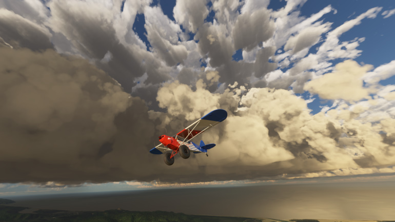

---

## Convective Day
- Medium sized Cumulus clouds, with cloud base at 8000ft AMSL
- South-westerly 12 knots wind, no gusts
- Great for soaring in a glider for ridge flight (modify wind direction in the preset to suit ridge orientation).
- If using a tool like Kinetic Assistant to add thermals, set the thermal top altitude to 8000ft AMSL to match the visuals (or modify all three cloud bases of the preset to match your thermal top)

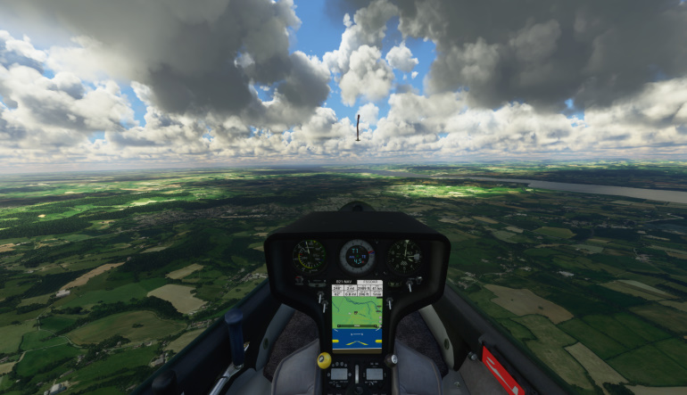

---

## Breezy
- More suitable for propeller aircraft
- Surface = 225/10 knots, gusting 18 knots
- 10,000 feet = 270/30 knots, no gusts
- 30,000 feet = 270/50 knots, no gusts

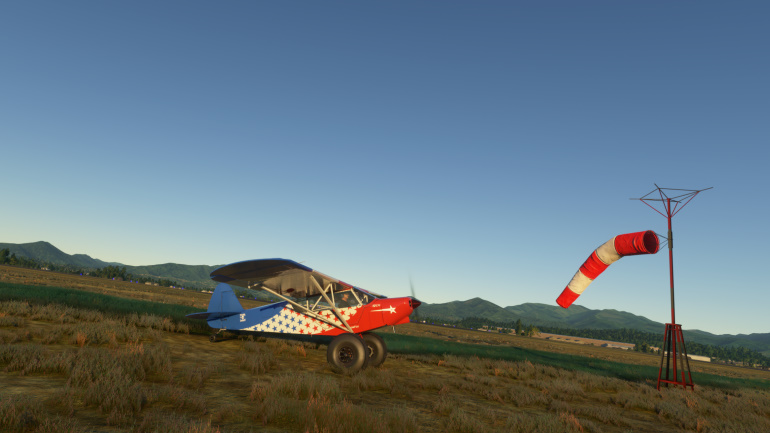

---

## Windy
- More suitable for turboprops/airliners
- Surface = 225/25 knots, gusting 40 knots
- 10,000 feet = 270/60 knots, no gusts
- 30,000 feet = 270/80 knots, no gusts

---

## Shallow Mist
- Affects slant/horizontal visibility in the mid to long range

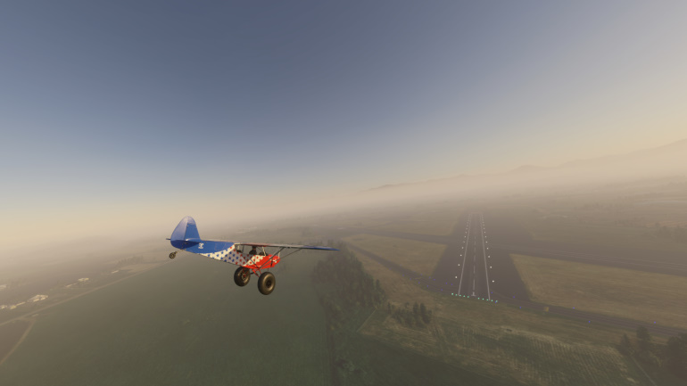

---

## Fog
- Affects slant/horizontal visibility in the short to mid range

---

## Thunderstorms
- Large but scattered high precipitation thunderstorms with gusty winds

---

## Snow Showers
- Large but scattered high precipitation snow showers with light winds

---

## Light Snow Showers
- Large but scattered low precipitation snow showers with light winds
- Less lying snow than the Snow Showers preset

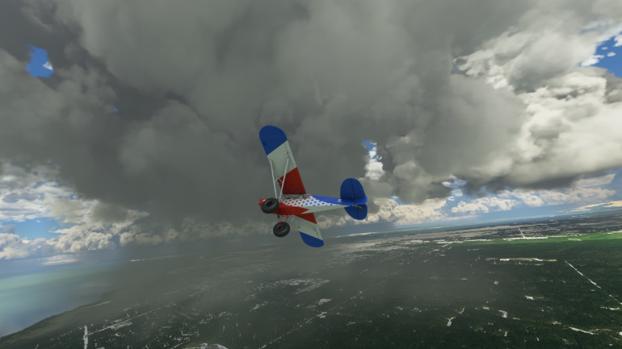

---

## Lying Snow
- Lying snow on the ground, no wind and some high altitude cloud

---

## De-icing (Utility preset)
- Large but scattered clouds with light winds
- 60 degree C air temperature as a de-icing utility, engine performance may be affected

---

# Experimental Presets
These are experimnetal presets that will get updated as the SDK/Sim progresses.

---

## KSPS - North
- Medium sized supercell just to the north of the airfield at KSPS (Wichita Falls)
- Frequent lightning, high precipitation and strong wind from N-NE
- Larger aircraft likely to need to climb out through the cell when departing north

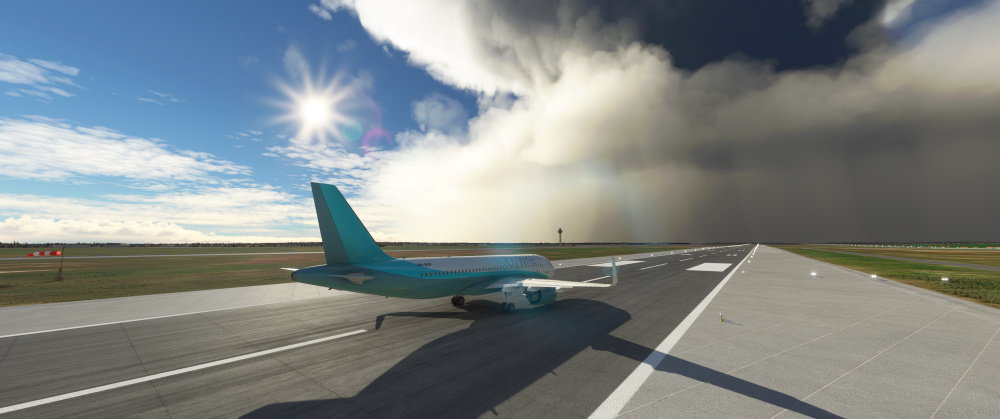

---

## KSPS - South
- Medium sized supercell just to the south of the airfield at KSPS (Wichita Falls)
- Frequent lightning, high precipitation and strong wind from N-NE
- Larger aircraft likely to need to approach for landing through the cell from the south

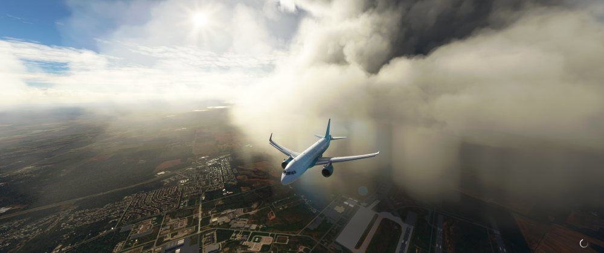

---

## EGLC - West
- Medium sized supercell just to the west of the airfield at EGLC (London City)
- Also affects operations to the east of EGLL (Heathrow)

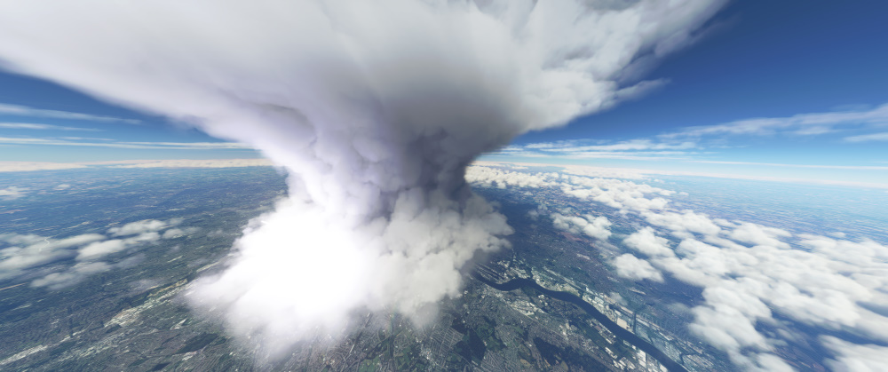

---

## KEWR - North-east
- Medium sized supercell just to the north-east of the airfield at KEWR (Newark)
- Also affects operations to the west of Manhatten

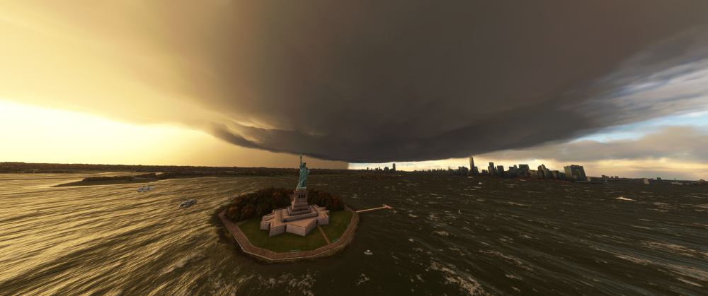

---

## YSSY - North-west
- Medium sized supercell just to the north-west of the airfield at YSSY (Sydney)
- Also affects operations to the west of the Sydney Opera House

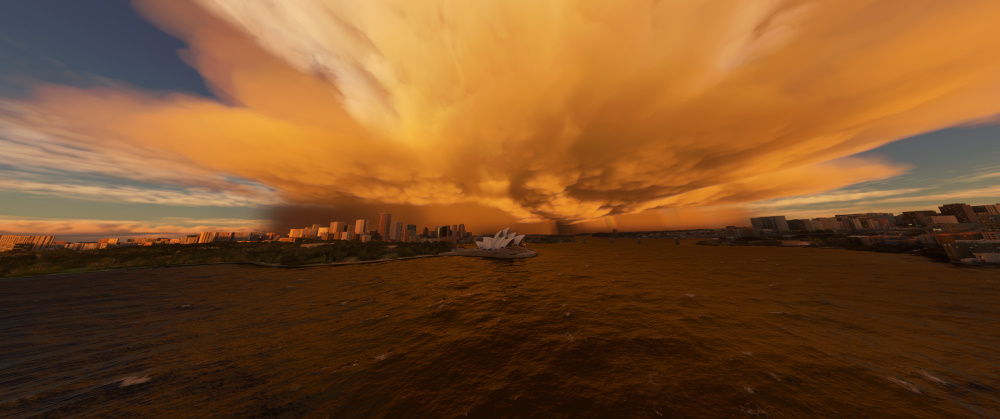

---

## RJTT - North
- Medium sized supercell just to the north of the airfield at RJTT (Haneda)
- Also affects operations over Tokyo itself

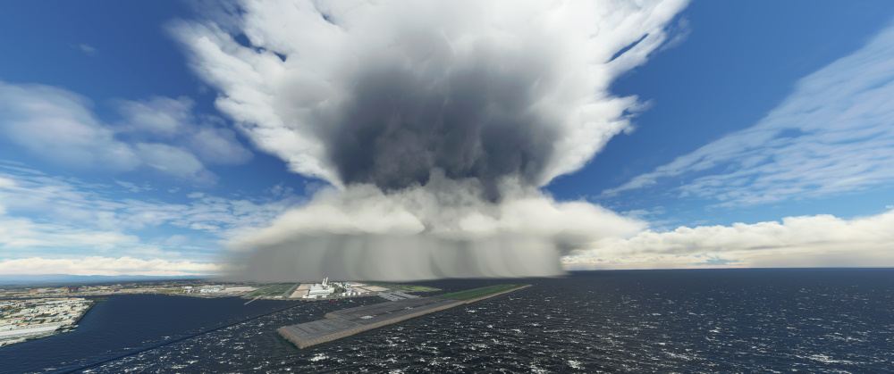

---

*This is a work in progress !!*