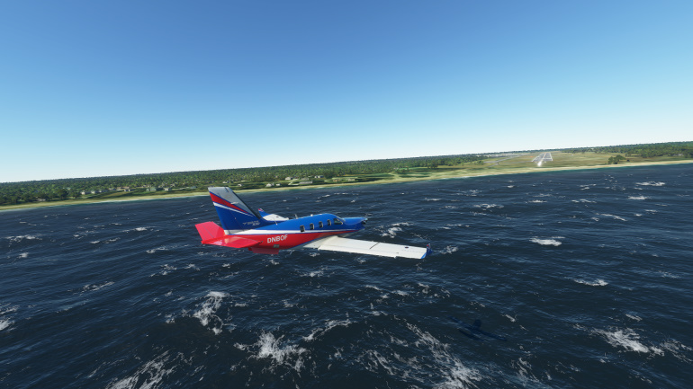
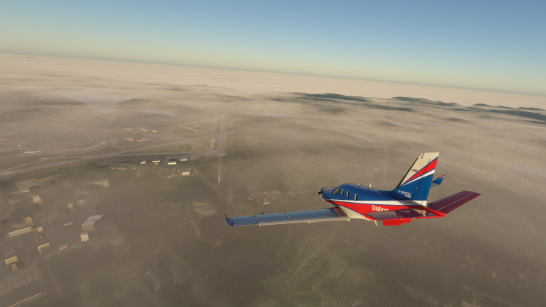
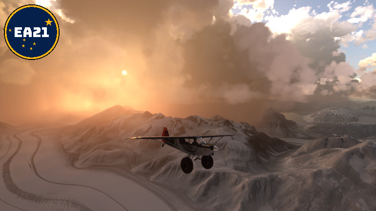
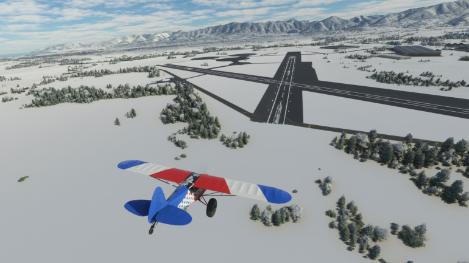

# Microsoft Flight Simulator 2020 - Weather presets test
Testing weather presets for Microsoft Flight Simulator 2020

Download the repo as a [ZIP file](https://github.com/DoNotBeOnFire/msfs2020-weather-presets/archive/main.zip) (or click the green "Code" button"), unpack and then copy **only** the included folder `dnbof-weather-presets-pack` into the Community folder of the sim. Start the sim and the new presets should appear on the weather presets list.

---

## Windy
- Surface = 225/25 knots, gusting 40 knots
- 10,000 feet = 270/60 knots, no gusts
- 30,000 feet = 270/80 knots, no gusts

---

## Shallow Mist
- Affects slant/horizontal visibility in the mid to long range

---

## Fog
- Affects slant/horizontal visibility in the short to mid range

---

## Thunderstorms
- Large but scattered high precipitation thunderstorms with gusty winds

---

## Snow Showers
- Large but scattered high precipitation snow showers with light winds
- Created to support [Expedition Alaska 2021](https://discord.gg/4f3j4YgNm4)

---

## Lying Snow
- Lying snow on the ground, no wind and some high altitude cloud
- Created to support [Expedition Alaska 2021](https://discord.gg/4f3j4YgNm4)

---

## De-icing (Utility preset)
- Large but scattered clouds with light winds
- High air temperature as a de-icing utility, engine performance may be affected
- Created to support [Expedition Alaska 2021](https://discord.gg/4f3j4YgNm4)

---

*This is a work in progress !!*